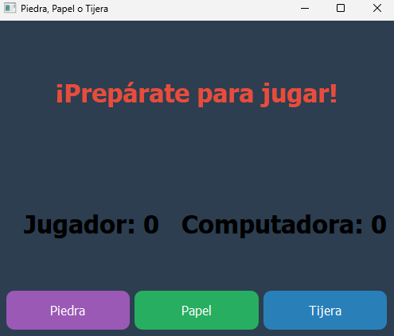

# Piedra, Papel o Tijera en Python

Este repositorio contiene el código fuente de un juego de piedra, papel o tijera implementado en Python con una interfaz gráfica de usuario (GUI) usando **Tkinter** y utilizando principios de programación orientada a objetos (POO).

## Descripción

Este proyecto fue desarrollado como parte de mi aprendizaje en programación con Python, con el objetivo de aplicar conceptos de GUI y POO. 

## Cómo jugar

1. Clona el repositorio en tu máquina local.
2. Ejecuta el archivo `piedra_papel_tijera.py` desde tu terminal usando el comando `python piedra_papel_tijera.py`.
3. Interactúa con la interfaz gráfica para elegir tu jugada (piedra, papel o tijera).
4. El programa generará una jugada aleatoria para la computadora, la mostrará en la interfaz y determinará el ganador.

## Próximos pasos

* [ ] Añadir la opción de jugar contra otro jugador humano a través de la red.
* [ ] Implementar diferentes niveles de dificultad para la computadora.
* [ ] Añadir animaciones y efectos visuales para mejorar la experiencia de juego.

## Cómo contribuir

Las "pull requests" son bienvenidas. Para reportar errores o sugerir mejoras, por favor crea un "issue" en este repositorio.

## Contacto

[MarpSparta](https://github.com/MarpSparta117)
